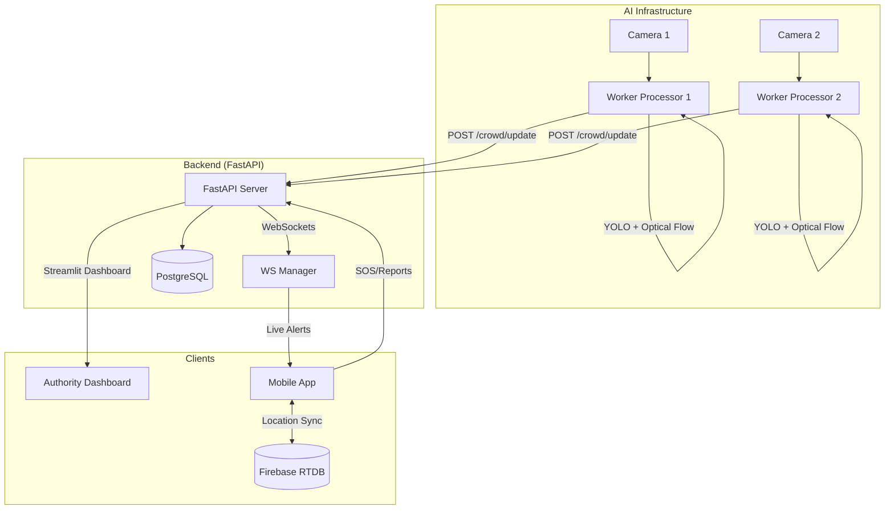
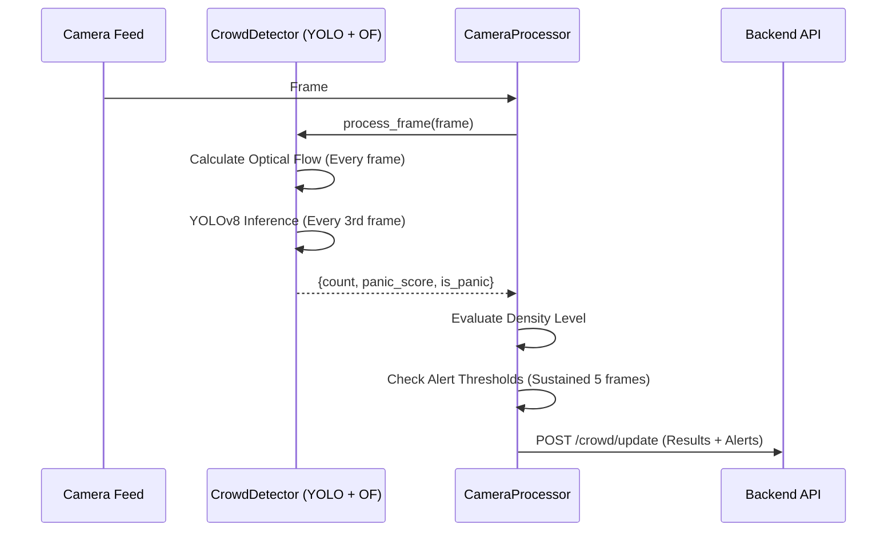
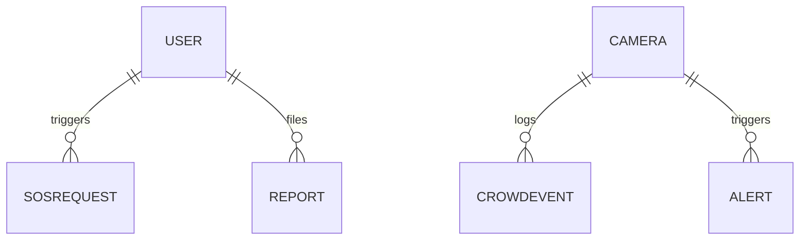

# MahaKumbh 2027 Smart Guide: Project Knowledge Extraction

This document provides a comprehensive analysis and reverse engineering of the **MahaKumbh 2027 Smart Guide** project. It encompasses technical, functional, and business perspectives to serve as a definitive resource for documentation, presentation, and further development.

---

# 1. PROJECT OVERVIEW

### Core Identity
*   **Project Name:** MahaKumbh 2027 Smart Guide
*   **Project Domain:** Public Safety, Disaster Management, Smart Tourism, and Civic Technology.
*   **Industry/Use Case:** High-density event management and religious pilgrimage assistance.

### Problem Statement
The MahaKumbh Mela is one of the world's largest religious gatherings (over 100 million people). The core challenges addressed are:
1.  **Safety Risks:** High probability of stampedes, crowd crushes, and panic events in narrow ghats and bridges.
2.  **Infrastructure Strain:** Massive network congestion (4G/5G failure) makes online-dependent apps (Google Maps, WhatsApp) unreliable.
3.  **Coordination Difficulty:** Families and groups frequently get separated in the chaos.
4.  **Information Gap:** Pilgrims often lack access to ritual schedules, bating dates, and emergency facilities without a physical guide.

### Objectives & Success Criteria
*   **Safety:** Real-time detection of crowd density spikes and panic behavior using AI.
*   **Reliability:** 100% offline access to navigation and spiritual content.
*   **Resilience:** Guaranteed delivery of SOS alerts through local queuing and background synchronization.
*   **Coordination:** Low-latency group location sharing.

### Business Value
The project shifts the paradigm from "Reactive" to "Proactive" crowd management. By providing authorities with real-time AI-driven heatmaps and providing pilgrims with offline tools, it reduces the risk of mass casualties and improves the overall quality of the pilgrimage experience.

---

# 2. FUNCTIONAL UNDERSTANDING

### Core Modules & Workflows

#### A. AI Surveillance Workflow (Authorities)
1.  **Multi-Camera Input:** Parallel worker processes ingest RTSP/Video feeds.
2.  **Detection & Counting:** YOLOv8 identifies and counts individuals every 3 frames (optimized).
3.  **Panic Detection:** Optical Flow (Farneback algorithm) measures motion magnitude. A sudden spike relative to the baseline (EMA) triggers a "Panic" alert.
4.  **Dashboard Visualization:** A Streamlit-based panel displays live counts, density levels (Low/Medium/High), and panic logs with atomic snapshots from cameras.

#### B. Safety & SOS Workflow (Pilgrims)
1.  **Trigger:** One-tap SOS button in the mobile app.
2.  **Local Persistance:** SOS details (GPS, battery, category) are saved in a local **Isar** database.
3.  **Background Sync:** **WorkManager** schedules a persistent task to retry transmission until a network connection is detected and the backend acknowledges the receipt.
4.  **Authority Response:** Authorities see the SOS in real-time on the dashboard with precise GPS coordinates.

#### C. Offline Navigation Workflow
1.  **Map Tile Caching:** The app uses `flutter_map` with local tile caching for pre-selected sectors (Ghats, Camps, Medical).
2.  **Predefined Routing:** Routes between key locations are pre-calculated or fetched from OSRM and cached, ensuring navigation works without a server connection.

#### D. Group Coordination (Find My Group)
1.  **Real-time Sync:** Uses **Firebase Realtime Database** for low-latency position updates among group members.
2.  **Privacy Control:** Users can toggle location sharing on/off.

#### E. Spiritual Guide
1.  **Offline Content:** Ritual calendars, Shahi Snan (bathing) dates, and cultural info stored as local JSON assets.

---

# 3. BUSINESS LOGIC ANALYSIS

### Key Decision-Making Logic
*   **Density Thresholding:** Logic in `processor.py` categorizes counts based on camera-specific thresholds (e.g., `count > 50` = High).
*   **Sustained Alert Logic:** To prevent false positives from temporary obstructions, a "High Density" alert is only triggered if the threshold is breached for **5 consecutive frames**.
*   **Panic Cooldown:** Once a panic event is detected, a 10-second cooldown prevents alert spamming (`PANIC_COOLDOWN_SECONDS`).
*   **SOS Retry Strategy:** Uses exponential backoff (starting at 30s) to preserve battery life while ensuring reliable transmission during intermittent connectivity.

### Validation & Security Rules
*   **API Security:** AI Workers communicate with the backend using a specialized `X-API-Key` to prevent unauthorized crowd data injection.
*   **SOS Ownership:** SOS requests are tied to a unique device/user UUID to track status across sessions.

---

# 4. SYSTEM ARCHITECTURE

### High-Level Architecture
The system follows a **Hybrid Decentralized Architecture**:
*   **Edge Processing (Simulated):** AI workers process video feeds locally (multi-process) and only send metadata (counts/alerts) to the cloud.
*   **Cloud Centralization:** FastAPI handles the aggregation of data and coordination of SOS requests.
*   **Offline-First Clients:** Mobile apps act as independent units that synchronize with the cloud when possible.

### Architecture Diagrams

#### System Interaction Diagram

#### AI Crowd Analysis Sequence

---

# 5. TECHNICAL STACK ANALYSIS

| Component | Technology | Rationale | Tradeoffs |
| :--- | :--- | :--- | :--- |
| **Mobile** | Flutter | Cross-platform (iOS/Android) with high-performance rendering for maps. | Larger binary size compared to native. |
| **State Management** | Riverpod | Robust, compile-safe state management suitable for complex async flows. | Steeper learning curve than Provider. |
| **Backend** | FastAPI | High-performance, async-first Python framework for real-time APIs. | Newer than Django/Flask (smaller ecosystem). |
| **AI (Object Detection)** | YOLOv8n (Nano) | Fastest inference speed for multi-camera streams on consumer hardware. | Lower accuracy than YOLOv8x. |
| **AI (Motion)** | OpenCV Optical Flow | Detects movement patterns (panic) without requiring complex pose estimation. | Sensitive to lighting changes. |
| **Database (Relational)** | PostgreSQL | Industry standard for structured safety data and relational integrity. | Requires more setup than NoSQL. |
| **Database (Local)** | Isar (Mobile) | Extremely fast, ACID-compliant local storage for offline SOS queuing. | Schema changes require code generation. |
| **Real-time** | WebSockets + Firebase | WebSockets for system-wide alerts; Firebase for p2p location sharing. | Managing dual sync channels. |

---

# 6. DATABASE DESIGN

### Core Entities
*   **User:** Stores pilgrim profile and emergency contact info.
*   **Camera:** Metadata for surveillance points (ID, location, thresholds).
*   **CrowdEvent:** Historical log of density and panic scores for trend analysis.
*   **SOSRequest:** Tracks help requests, GPS, status (Pending/Acknowledged/Resolved).
*   **Report (Lost & Found):** Community reports with image paths and descriptions.

### ER Diagram (Simplified)

---

# 7. CODEBASE STRUCTURE

### Directory Responsibilities
*   `/backend/app/routers`: Logic for specific features (SOS, Alerts, Crowd).
*   `/backend/workers`: The AI "Engine". `supervisor.py` manages the lifecycle of `CameraProcessor` processes.
*   `/backend/dashboard`: Streamlit UI code.
*   `/mobile/lib/services`: External integrations (Maps, API, SOS sync).
*   `/mobile/lib/providers`: Domain-specific state logic (e.g., `NavigationProvider` for offline maps).

### Design Patterns
*   **Observer Pattern:** Used in WebSockets for broadcasting crowd alerts to connected clients.
*   **Worker Pattern:** Decouples AI inference from the API server to prevent request blocking.
*   **Repository Pattern:** (Inferred) Mobile app uses Isar/Firebase abstractions to handle data regardless of source.

---

# 8. SECURITY & RESILIENCE

### Security Model
*   **Data Integrity:** SOS requests are signed with device UUIDs.
*   **Access Control:** Authorities use a separate dashboard; pilgrims have limited API access.
*   **API Shielding:** Workers use internal API keys for secured data ingestion.

### Resilience Strategy
*   **Offline-First:** All critical app features (Navigation, Rituals, SOS) function without a server.
*   **Graceful Degradation:** If OSRM routing fails, the app falls back to straight-line distance.
*   **Atomic Operations:** AI workers use "temp-file + replace" for snapshots to prevent UI flickering or corruption during reads.

---

# 9. DESIGN DECISIONS + ENGINEERING REASONING

1.  **Why Optical Flow for Panic?**
    *   *Reasoning:* Detecting a "stampede" purely by counting people is impossible. People can be densely packed but stationary (safe). Panic is defined by *sudden, high-velocity erratic movement*. Optical flow captures this motion magnitude efficiently.
2.  **Why every 3rd frame for YOLO?**
    *   *Reasoning:* At 30 FPS, processing every frame is redundant and computationally expensive. 10 inferences per second is more than enough to track crowd trends while freeing up 66% of CPU/GPU resources.
3.  **Why Streamlit for Dashboard?**
    *   *Reasoning:* Rapid prototyping. Authorities need a functional, data-heavy interface quickly. Streamlit integrates perfectly with the Python-based AI backend.
4.  **Why discrete markers (G/Y/R) over heatmaps?**
    *   *Reasoning:* On a mobile screen in bright sunlight, a complex heatmap is hard to read. A Red dot on a specific bridge is an unambiguous signal to "Avoid this area".

---

# 10. CHALLENGES & LIMITATIONS

### Likely Development Challenges
*   **Syncing Multi-Process Workers:** Ensuring that parallel AI workers don't crash the main system when one camera feed drops.
*   **Flutter Map Performance:** Smoothly rendering thousands of custom markers on lower-end Android devices.
*   **GPS Accuracy:** High density often leads to "multipath" GPS errors; the system must handle jittery coordinates.

### Future Improvements
*   **Predictive AI:** Using LSTMs to predict crowd density 30 minutes in advance based on historical trends.
*   **Mesh Networking:** Implementing Bluetooth-based peer-to-peer communication for SOS when cellular networks are completely dead.
*   **Edge Hardware:** Deploying the AI workers on NVIDIA Jetson devices at the camera pole itself.

---

# 11. VIVA / PRESENTATION PREPARATION

### "Elevator Pitch"
"The MahaKumbh Smart Guide is an AI-powered safety ecosystem for the world's largest gathering. It uses real-time computer vision to detect stampedes before they happen and provides pilgrims with 100% offline navigation and a guaranteed-delivery SOS system that works even when the internet fails."

### Likely Technical Questions
*   **Q: How does the SOS work if there is no internet?**
    *   *A:* It is stored in an ACID-compliant local database (Isar) and queued. A background service (WorkManager) monitors network state and automatically retries transmission as soon as connectivity is restored.
*   **Q: Why use YOLOv8 for counting?**
    *   *A:* YOLOv8 (specifically the Nano version) offers the best balance of speed and accuracy for real-time person detection, allowing us to monitor dozens of cameras simultaneously on standard hardware.
*   **Q: How do you handle "False Alarms" in panic detection?**
    *   *A:* We use an EMA (Exponential Moving Average) to establish a "normal" motion baseline for each camera. Alerts are only triggered when motion magnitude exceeds 3.5x this baseline, filtering out regular crowd movement.
*   **Q: What happens if the backend server goes down?**
    *   *A:* The mobile app is designed to be fully functional offline. Pilgrims can still navigate, see ritual schedules, and queue SOS requests. Only real-time crowd updates and live group sync would be paused.
